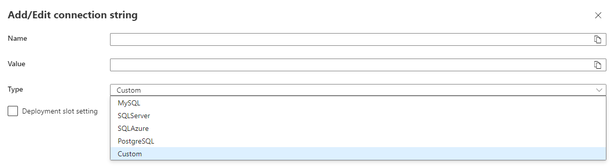

# Azure App Service
- Azure App Service is an HTTP-based service for hosting web applications, REST APIs, and mobile back ends
- Scale up/down or scale out/in
- Essentially, it provides the ability to run apps in Linux or Windows VMs, in a private or public network
- Just deploy to Azure, without ACI or custom created VMs

## App Service plans
- An App Service plan defines a set of compute resources for a web app to run
- In App Service, an app (Web Apps, API Apps, or Mobile Apps) always runs in an App Service plan
- Azure Functions also has the option of running in an App Service plan
- App Service plan is the scale unit of the App Service apps 
- If the plan is configured to run five VM instances, then all apps in the plan run on all five instances
- If the plan is configured for autoscaling, then all apps in the plan are scaled out together based on the autoscale settings

## App Service plans - Types
# Non-isolated
- **Shared compute**
  - Both Free and Shared share the resource pools of your apps with the apps of other customers. 
    Essentially, my app runs in the same VM with other apps from other clients
- **Dedicated compute**
  - Basic (B1, B2, B3)
  - Standard (S1, S2, S3)
  - PremiumV2 (P1v2, P2v2, P3v2)
  - PremiumV3 (P1v3, P2v3, P3v3)

# Isolated
- Fully isolated and dedicated environment (dedicated Azure VMs on dedicated Azure Virtual Networks)
- Isolation and secure network access
- High scale, high memory utilization

# Consumption
- This tier is only available to function apps. It scales the functions dynamically depending on workload.

## How does my app run and scale
- In the Free and Shared tiers, an app receives CPU minutes on a shared VM instance and can't scale out
- In other tiers, an app runs and scales as follows:
  - An app runs on all the VM instances configured in the App Service plan.
  - If multiple apps are in the same App Service plan, they all share the same VM instances.
  - If you have multiple deployment slots for an app, all deployment slots also run on the same VM instances.
  - If you enable diagnostic logs, perform backups, or run WebJobs, they also use CPU cycles and memory on these VM instances.

## Authentication and authorization in App Service
- not mandatory to be used
- it is a separate module, that runs next to my deployment, and essentially acts like a proxy
- supports major identity providers (AAD, Facebook, Google, Twitter, any OIDC provider)

## Authentication flow
- **Without provider SDK**: The application delegates sign-in to App Service. This is typically the case with browser apps, which can present the provider's login page to the user. 
  The server code manages the sign-in process, so it is also called **server-directed flow** or **server flow**
- **With provider SDK**: The application signs users in to the provider manually and then submits the authentication token to App Service for validation
  This is typically the case with browser-less apps, which can't present the provider's sign-in page to the user
  The application code manages the sign-in process, so it is also called **client-directed flow** or **client flow**.
  This applies to:
  - REST APIs
  - Azure Functions
  - JavaScript browser clients
  - native mobile apps that sign users in using the provider's SDK

## Authorization behavior
- **Allow unauthenticated requests**: This option defers authorization of unauthenticated traffic to your application code
- **Require authentication**: 
  - This option will reject any unauthenticated traffic to your application
  - This rejection can be a redirect action to one of the configured identity providers

## Adding volumes
- we need to have a preconfigured storage account with the necessary file shares
- we can mount the volumes in the Configuration menu, under **Path mappings**

## Configure application settings
- in the portal they can be changed in the Configuration menu, under **Settings**
-  these are environment variables
- connection strings can also be configured here (such as connections to the DB). Connection strings also act as environment settings
  The reason you might want to use connection strings (especially in non-dotNET languages):
  - is that some Azure database types are backed up along with the app only if you configure a connection string for the database 
    in your App Service app. Essentially, the connection string acts as a declaration required by the DB, so it can recognize a certain application
 

## Adding logs
- in the Monitoring section, select App Service logs and enable application logging

## Secure a domain with SSL/TLS binding
- cannot be done for the Free and Shared tiers
- can use public(bought from an authority) and private(self-signed) certificates
- Managed certificate -> one that is provided and managed by Azure
- Un-managed certificate -> one that is provided by me (public or private)
- can enforce HTTPS and TLS versions

## Configure security certificates
**Create a free App Service managed certificate** - A private certificate that's free of charge and easy to use if you just need to secure your custom domain in App Service.
**Purchase/Import an App Service certificate**	- A private certificate that's managed by Azure. It combines the simplicity of automated certificate management and the flexibility of renewal and export options.
**Import a certificate from Key Vault**	- Useful if you use Azure Key Vault to manage your certificates.
**Upload a private certificate** - If you already have a private certificate from a third-party provider, you can upload it.
**Upload a public certificate**	- Public certificates are not used to secure custom domains, but you can load them into your code if you need them to access remote resources.

## Creating a free managed certificate
- App Service plan must be in the Basic, Standard, Premium, or Isolated
- You create the certificate and bind it to a custom domain, and let App Service do the rest

# Purchase/Import an App Service Certificate
- If you purchase an App Service Certificate from Azure, Azure manages the following tasks:
  - Takes care of the purchase process from GoDaddy
  - Performs domain verification of the certificate
  - Maintains the certificate in Azure Key Vault
  - Manages certificate renewal
  - Synchronize the certificate automatically with the imported copies in App Service apps
- If you already have a working App Service certificate, you can:
  - Import the certificate into App Service
  - Manage the certificate, such as renew, rekey, and export it

## Scale apps in Azure App Service
- Manual 
- Autoscaling: 
  - can be configured in Settings/Scale out 
  - based on:
    - a metric, such as CPU utilization
    - according to a schedule, in a specific interval
  - provides elasticity for your services
  - improves availability and fault tolerance
  - works by adding or removing web servers
  - isn't the best approach to handling long-term growth

- Scale up/down (vertical)
- Scale out/in (horizontal)

## Metrics for autoscale rules
- **The rules are evaluated across all instances**
- **Consider defining autoscale rules in pairs in the same autoscale condition**- 
- **CPU Percentage** - This metric is an indication of the CPU utilization across all instances. A high value shows that instances are becoming CPU-bound, which could cause delays in processing client requests.
- **Memory Percentage** - This metric captures the memory occupancy of the application across all instances. A high value indicates that free memory could be running low, and could cause one or more instances to fail.
- **Disk Queue Length** - This metric is a measure of the number of outstanding I/O requests across all instances. A high value means that disk contention could be occurring.
- **Http Queue Length** - This metric shows how many client requests are waiting for processing by the web app. If this number is large, client requests might fail with HTTP 408 (Timeout) errors.
- **Data In** - This metric is the number of bytes received across all instances.
- **Data Out** - This metric is the number of bytes sent by all instances.

## Combining autoscale rules
- A single autoscale condition can contain several autoscale rules
- When scaling out, the autoscale action will be performed if **any** of the scale-out rules are met. It works on an **or** basis
- When scaling in, the autoscale action will run only if **all** of the scale-in rules are met. It works on an **and** basis